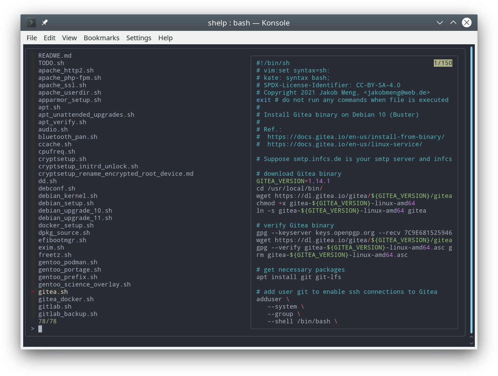

[//]: # ( vim:set syntax=markdown fileformat=unix shiftwidth=4 softtabstop=4 expandtab textwidth=120: )
[//]: # ( kate: syntax markdown; end-of-line unix; space-indent on; indent-width 4; word-wrap-column 120; )
[//]: # ( kate: word-wrap on; remove-trailing-spaces modified; )

# shell help: Take and view notes of your (and my) shell activity

No one likes writing documentation, not developers, nor operators. A simple approach is to pin down step by step all
commands you ran in a shell and add comments sporadically. It will help to remember what you did and hopefully why you
did so. It might also be useful as a blueprint for automation e.g. with Ansible. Your older self and your fellows will
appreciate it.

This repository has instructions on how to install [Debian](debian_setup.sh) and [Gentoo Prefix](gentoo_prefix.sh),
host [Nextcloud](nextcloud_setup.sh) and [Gitea](gitea.sh), configure [Apache2](apache_setup.sh) and
[Dovecot](dovecot.sh), create [SSL certificates](openssl_ca_guide.sh), benchmark using/with [FIO](fio.sh),
define [libvirt domains](libvirt.sh) and much more.
The guide below shows how to access these notes from a cli and how to add your own.

⚠️ **WARNING:** This repository resembles more of a personal sketchpad than a collection of complete guides. Most
documents belong to one of two categories, either annotated lists of commands and their arguments, e.g. for
[LVM](lvm.sh) or [StorCLI](storcli.sh), or step-by-step guides that walk you through all instructions e.g. to set up
[Nextcloud](nextcloud_setup.sh) or [Gitea](gitea.sh). Most guides miss any explaination of why things are done but
often list references that point to further documentation. Consider any content as work-in-progress, i.e. parts that I
use often are continuously refactored and updated while others might be outdated for years. ⚠️

⚠️ **WARNING:** Most guides and notes in this repository presume Debian 8 (Jessie), Debian 8 (Stretch) or
Debian 10 (Buster) as operating system and Bash as shell if not stated differently. ⚠️

## Requirements and Installation

Get or upgrade to Debian 10 (Buster). Open Bash and enter

```sh
# Install required packages
sudo apt install fzf git tre-agrep

# Clone repository
mkdir -p ~/.local/share/
git -C ~/.local/share/ clone https://github.com/JM1/shelp.git

# Configure Bash
cat << 'EOF' >> ~/.bashrc
# Enable fzf key bindings like Ctrl+R
. /usr/share/doc/fzf/examples/key-bindings.bash

# Enable shelp key binding (Ctrl+H)
_shelp_fzf() {
    FZF_DEFAULT_COMMAND="grep -l '*' *" fzf \
        --bind "change:reload:tre-agrep -1 -i -l {q} * || true" \
        --bind "pgup:preview-page-up,pgdn:preview-page-down" \
        --ansi --layout=reverse-list --border --height 100% --phony --query '' \
        --preview '[ -n {} ] && less {} '
}

_shelp() (
    cd "$HOME/.local/share/shelp/"
    FILE="$(_shelp_fzf)"
    [ -n "$FILE" ] && view "$FILE"
)

bind -x '"\C-h": "_shelp"'

EOF

# (Re)run Bash to apply changes
bash
```

## Tutorial

Open a shell and enter any commands. Enter `history` to list previous commands or press <kbd>Ctrl</kbd> + <kbd>R</kbd>
to fuzzy-find them. Write down a typescript of your shell activity, add comments if appropriate and store everything in
`~/.local/share/shelp/`. [Keep it simple, stupid](https://en.wikipedia.org/wiki/KISS_principle). Use plain text,
[Markdown](https://commonmark.org/) or whatever suits your use case best. Use [git](https://git-scm.com/book/) to track
changes. Later press <kbd>Ctrl</kbd> + <kbd>H</kbd> to fuzzy-find your notes and all examples provided in this
repository.



## License

Creative Commons Attribution Share Alike 4.0 International

See [LICENSE.txt](LICENSE.txt) to see the full text.

## Author

Jakob Meng
@jm1 ([github](https://github.com/jm1), [galaxy](https://galaxy.ansible.com/jm1), [web](http://www.jakobmeng.de))
